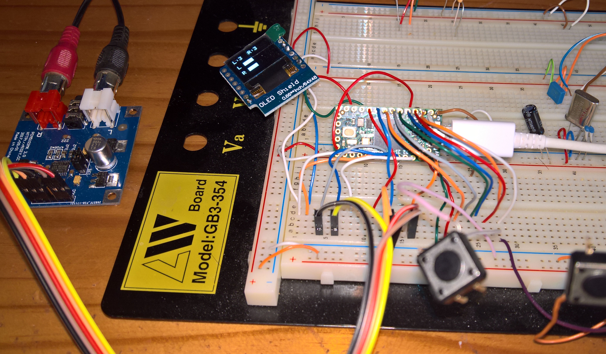
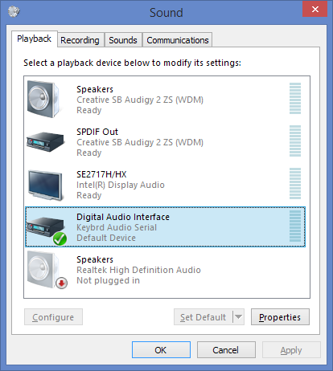
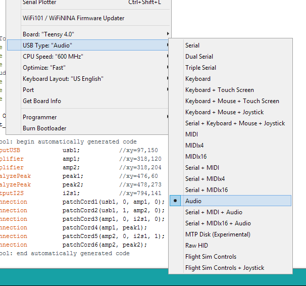
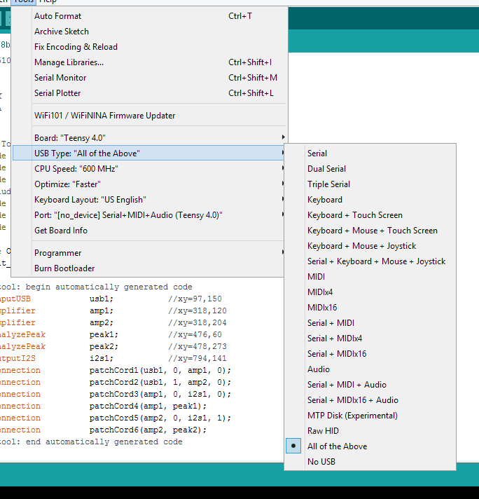

# Teensy4-USB-Audio-DAC-and-Volume-Control
Teensy4 USB Audio DAC and Volume Control using Volume Up and Down buttons (refer to Teensy4USBAudioKeybrd2.ino for the details) in :
 

  
 

Audio device in windows:
 

  
 

New USB choice in Arduino IDE for Teensy 4 (refer to changes in boards.txt and usb_desc.h):
 

  
 

  
  
  
Volume control using a rotary encoder to follow...
