# Teensy4-USB-Audio-DAC-and-Volume-Control

**Binary peak audio level display mode values range from 0 to 11111111:**

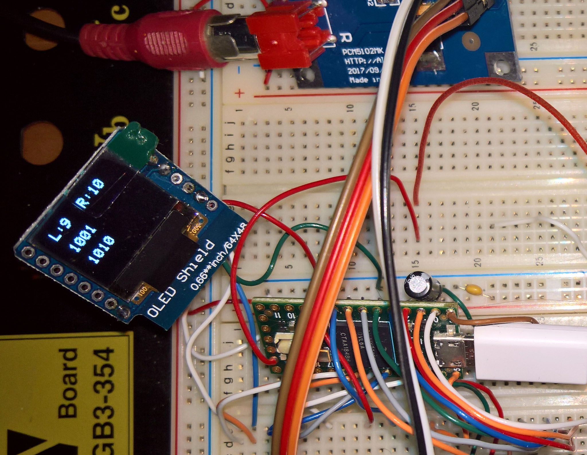  
 
  
This is a [**Teensy 4**](https://www.pjrc.com/store/) USB Audio DAC [**PCM5102**](https://www.robotics.org.za/PCM5102) and USB Volume Control using Volume Up and Down buttons (as in Teensy4USBAudioKeybrd2.ino) and with an additional rotary encoder as volume control (as in Teensy4USBAudioKeybrd6.ino). 

The encoder switch toggles the display on and off, and also cycle through three different displaymodes, which is changed each time the switch is pressed (i.e. pressed twice). The three displaymodes are bar graph, and two binary modes (0 to 11111111), as normal and inverted text. (It was noted that the mute function is not functional for this Teensy 4 USB Audio device - even using the mute from directly in windows has no effect). It may also be convenient to attach a pushbutton to the Teensy 4 on-off pin - pressing it for 5 seconds will switch the DAC off and pressing it again for 2 seconds will switch it back on.

Later another type of DAC was tried - namely the [**ESS ES9023 Sabre**](http://www.suptronics.com/miniPCkits/x900.html) 24-bit/192kHz DAC, with connections in Raspberry Pi GPIO layout: DATA pin 40 to Teensy pin 7, BCLK pin 12 to Teensy pin 21, LRCK pin 35 to Teensy pin 20 (MCLK is left unconnected - do not connect to GND). It used the Teensy 4.0's +5v supply and GND. Operation was flawless and the USB volume control also worked perfectly. See the last picture on this page for hook-up details.

Note that changes are required to boards.txt and to the Teensy 4 usb_desc.h - the current "All of the Above" option does not show when using the unmodified files. Refer to the two screendumps in the Programming section below.

### Schematic and construction and parts
Schematic of the Teensy 4.0 with a PCM5102 or ES9023 DAC and a 0.66" SSD1306 Wemos D1 Mini 64x48 i2c OLED Shield:
 

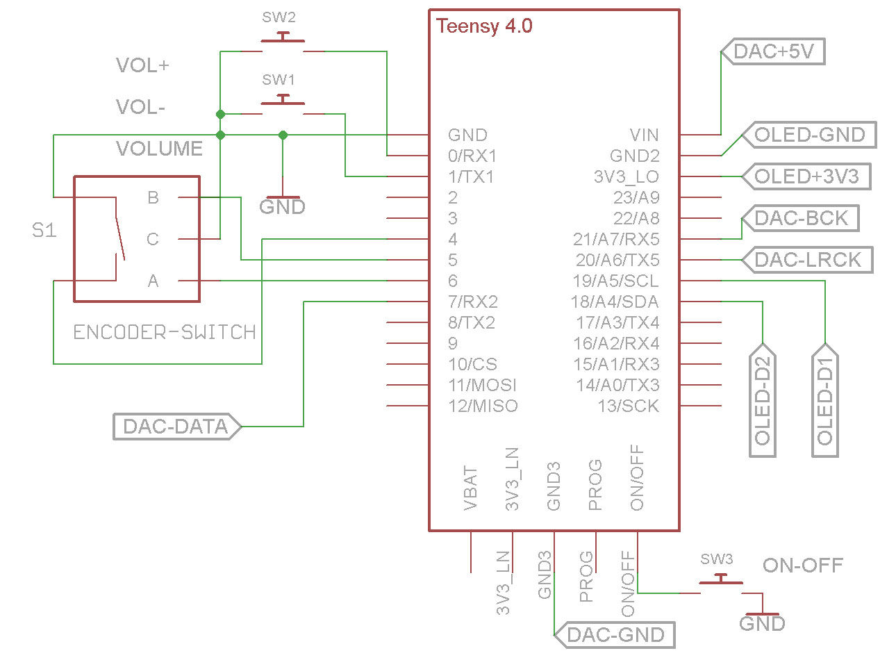 
 
  
1 - Case bottom houses the Teensy 4.0 and the PCM5102 DAC. The case lid holds the 64x48 OLED, optionally 3 pushbuttons, and the rotary encoder.

2 - All wired up - I decided to discard the three pushbuttons - they add little functionality. May add them again at a later stage.

3 - Finished - but it deserves a proper aluminium knob instead of a toothpase cap.

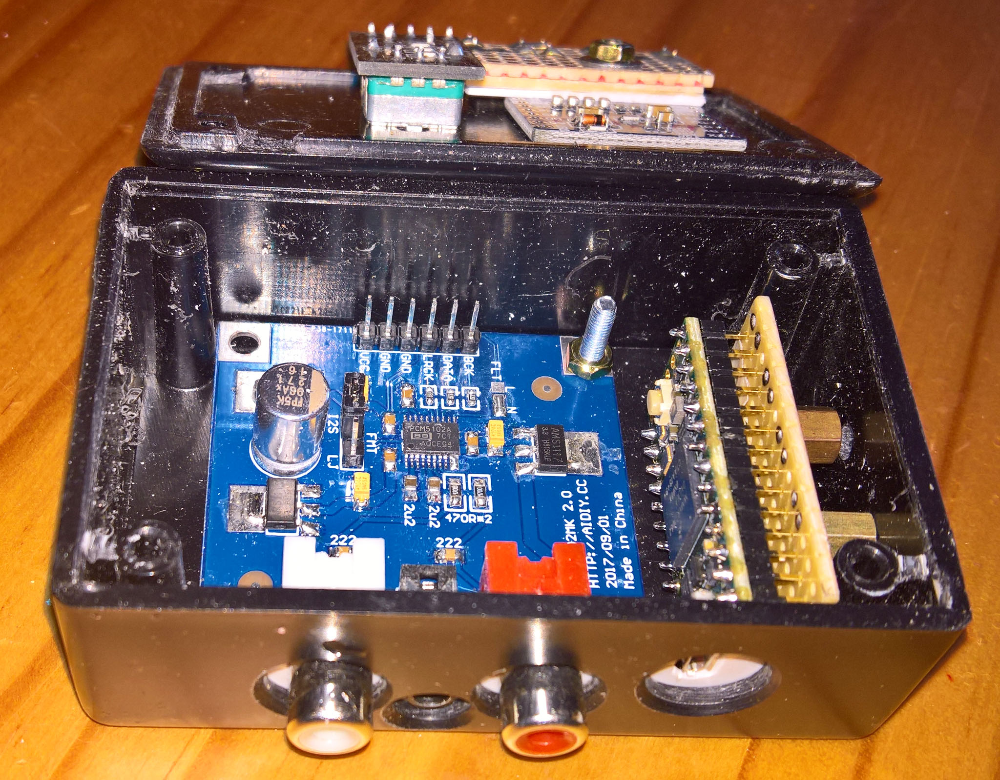  
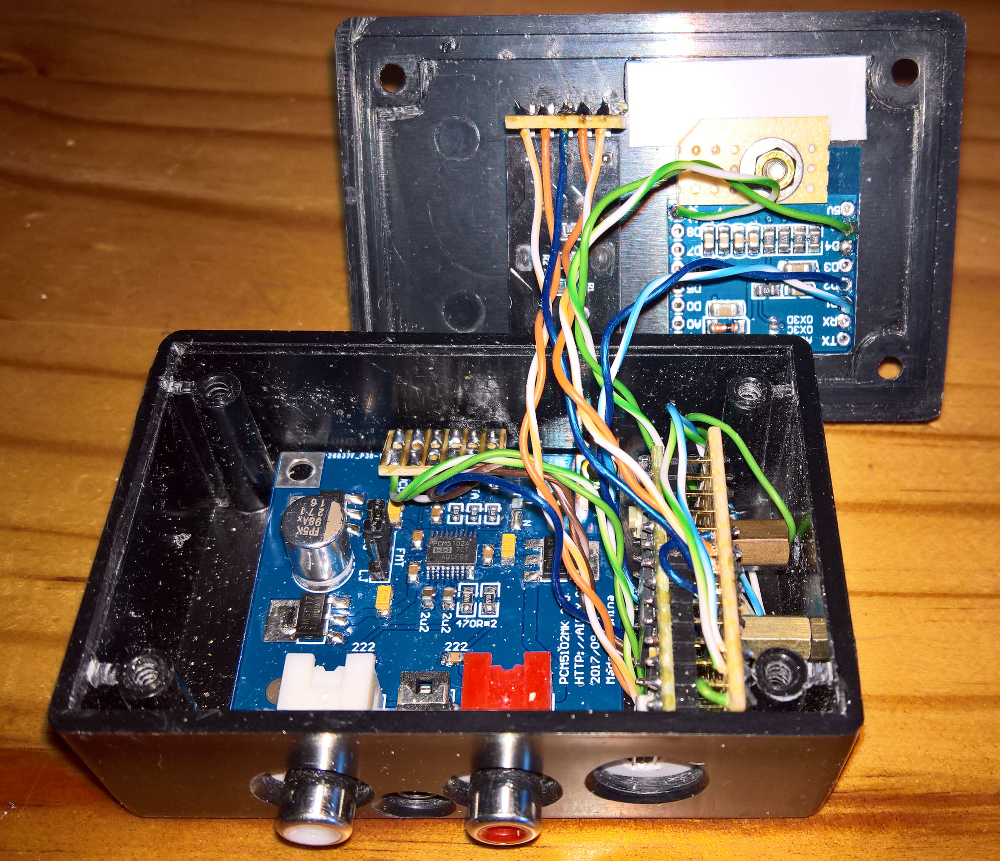  
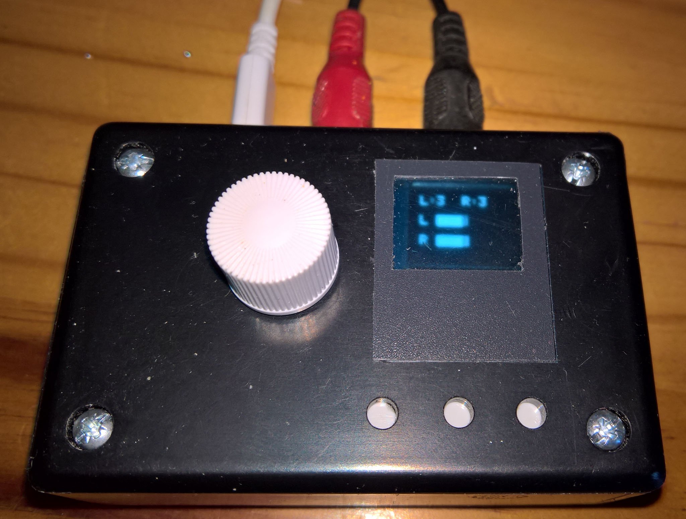  

0.66" SSD1306 Wemos D1 Mini 64x48 i2c OLED Shield and the KY040 Rotary Encoder:

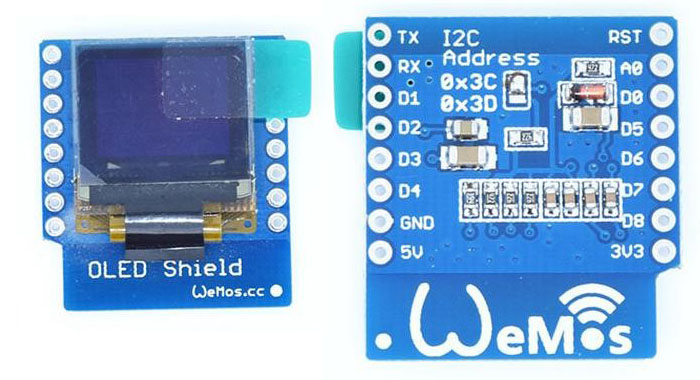  
  

  
PCM5102 DAC from [**Micro-Robotics**](https://www.robotics.org.za/PCM5102) and ES9023 DAC from [**Suptronics**](http://www.suptronics.com/miniPCkits/x900.html)
 

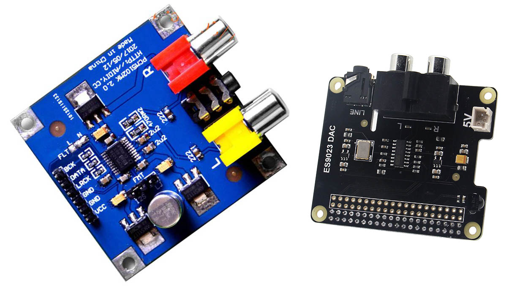  
  

### Programming

Audio device in windows:
 

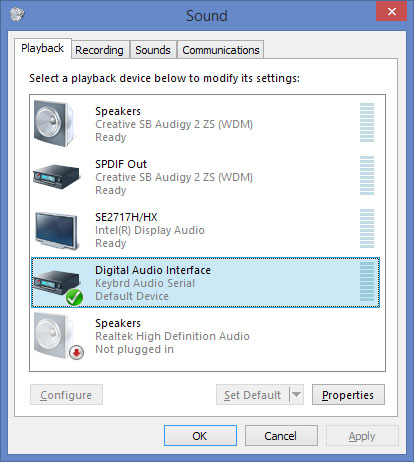  
 

Old and new USB choice in Arduino IDE for Teensy 4 (refer to the changes made in boards.txt and usb_desc.h):
 

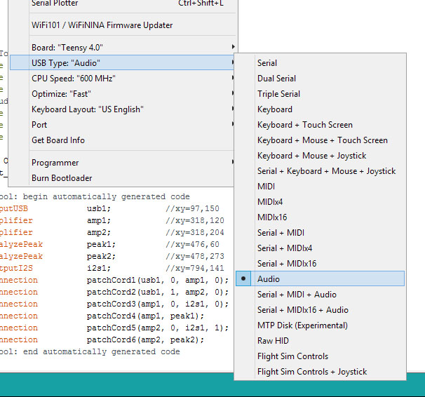  
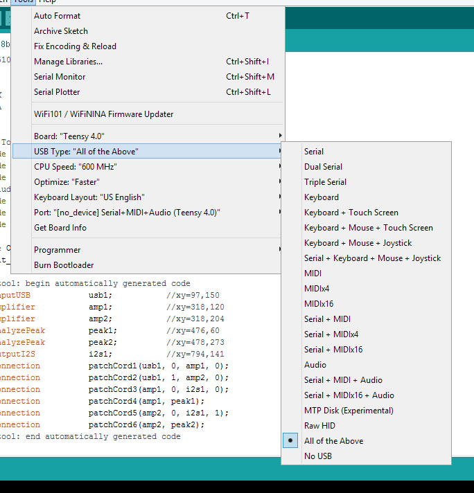  
  

### Initial testing and further construction details:
Initial testing with 2 volume up/down pushbuttons, and also with a rotary encoder as a USB volume control.

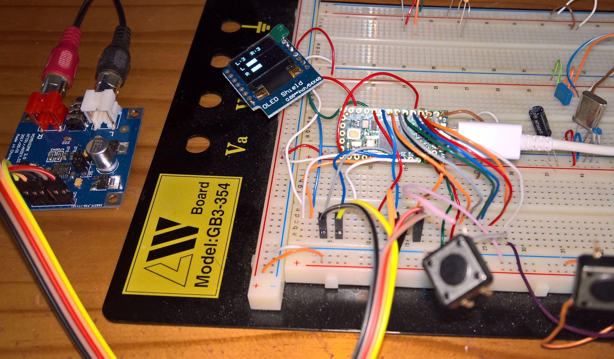  
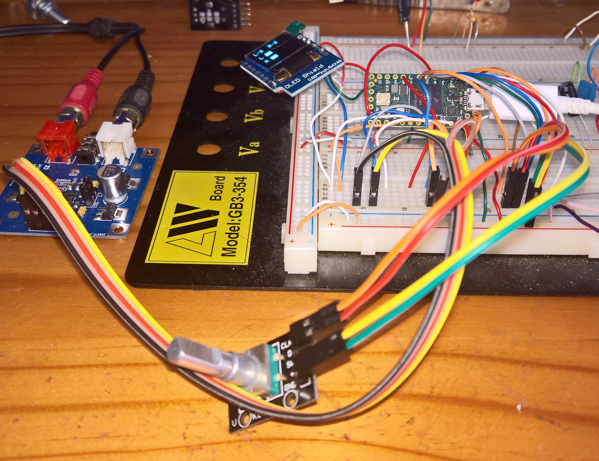  
 

Left: Case bottom (at the top) houses the Teensy 4.0 and the PCM5102 DAC. The case lid (at the bottom) houses the 64x48 OLED, 3 pushbuttons (optional), and the rotary encoder.

Right: ESS ES9023 Sabre DAC X900 Raspberry Pi GPIO format.
 

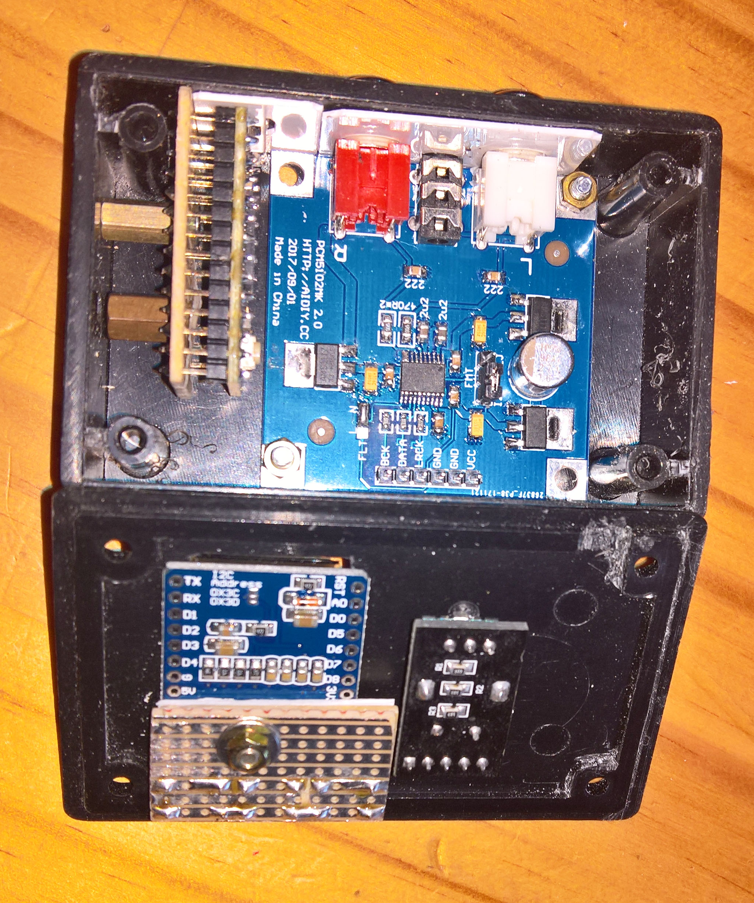  
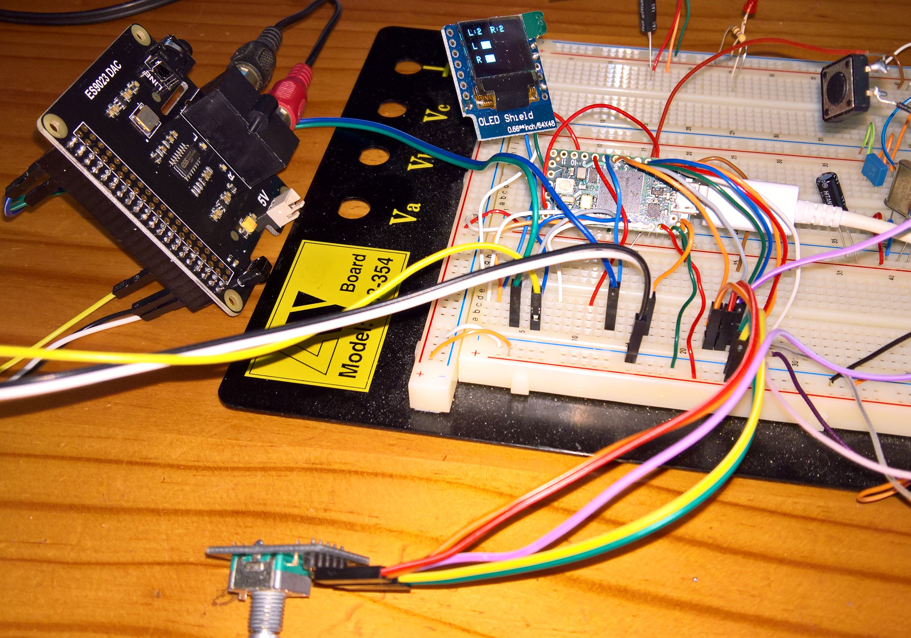  
 

