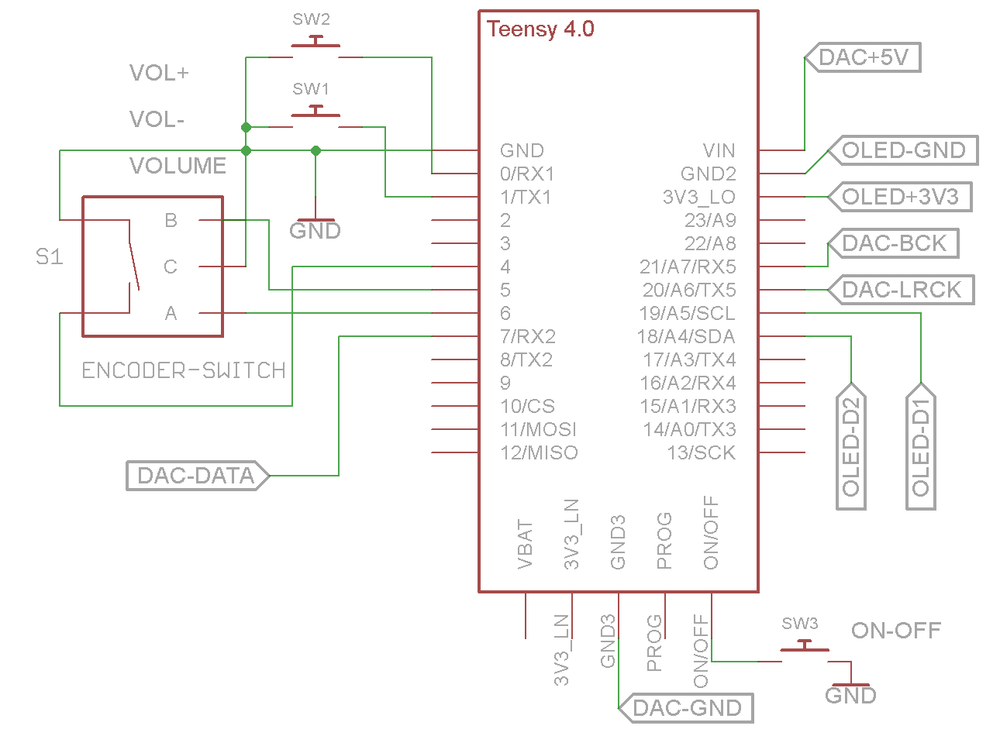
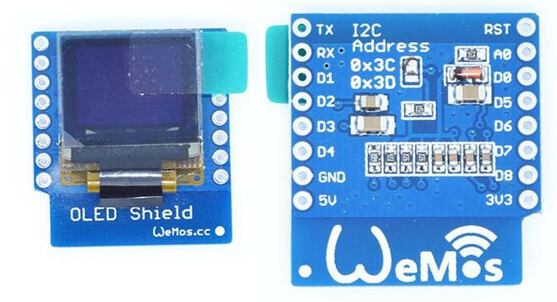

# Teensy4-USB-Audio-DAC-and-Volume-Control
This is a Teensy 4 (https://www.pjrc.com/store/) USB Audio DAC (PCM 5102) and Volume Control using Volume Up and Down buttons (Teensy4USBAudioKeybrd2.ino) and with an additional rotary encoder as volume control (Teensy4USBAudioKeybrd6.ino). 

The encoder push-button switches the display on and off (the mute function is not enabled in the Teensy 4 USB Audio device). It is also convenient to attach a pushbutton to the Teensy 4 on/off pin - pressing it for 5 seconds will switch the DAC off and pressing it again for 2 seconds will switch it back on.

### Schematic and construction and parts
Schematic Teensy 4.0 and a PCM5102 DAC and a 0.66" SSD1306 Wemos D1 Mini 64x48 i2c OLED Shield:
 

 
 
  
Bottom part contains the Teensy 4.0 and the PCM5102 DAC. The case lid holds the 64x48 OLED, 3 pushbuttons, and the encoder.
 

  
   
All wired up - decide to discard the three pushbuttons - they add little functionality.
 

  
 
  
Finished - must buy a proper aluminium knob instead of a toothpase cap.
 

  
 
  
0.66" SSD1306 Wemos D1 Mini 64x48 i2c OLED Shield:
 

  
  
  
KY040 Rotary Encoder2:
 

  
 

### Programming

Audio device in windows:
 

  
 

New USB choice in Arduino IDE for Teensy 4 (refer to changes in boards.txt and usb_desc.h):
 

  
 

  
  

### Initial testing and further construction details:

  
 

  
 

Bottom part contains the Teensy 4.0 and the PCM5102 DAC. The top part consists of the 64x48 OLED, 3 pushbuttons, and the encoder.
 

  
 

  
 
