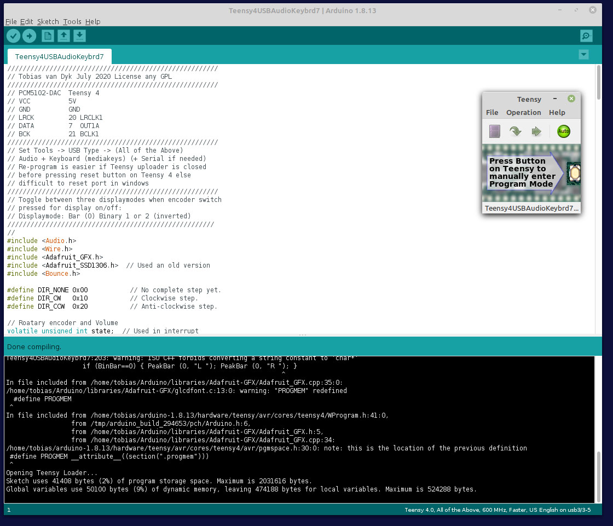

# Teensy4-USB-Audio-DAC-and-Volume-Control

Binary peak audio level display mode values range from 0 to 11111111:

This is a [**Teensy 4**](https://www.pjrc.com/store/) USB Audio DAC [**PCM5102**](https://www.robotics.org.za/PCM5102) and USB Volume Control using Volume Up and Down buttons (in Old-2020/Teensy4USBAudioKeybrd2.ino) and with an additional rotary encoder as volume control (as in Teensy4USBAudioKeybrd8.ino or the 2020 version Old-2020/Teensy4USBAudioKeybrd7.ino).

Although it was tested with a Teensy 4.0 at 16bit/44.1kHz for both the PCM5102 and ES9023 Audio DACs, a recent change to the Teensyduino core should enable higer (44.1, 48, 88.2 96 kHz), sampling rates - see:
1. [**USB-Audio-samplerates-added**](https://forum.pjrc.com/threads/67749-USB-Audio-samplerates-added)
2. [**DIY USB Audio Cable**](https://forum.pjrc.com/threads/69760-DIY-USB-Audio-Cable?p=302493&viewfull=1#post302493) This link mentions that: *there are some variants of the Audio library out there supporting higher bit depths, and the 44.1kSPS is configurable by editing AudioStream.h in the core libraries, look for the AUDIO_SAMPLE_RATE_EXACT #define*
3. [**Discussion about a simple way to change the sample-rate**](https://forum.pjrc.com/threads/38753-Discussion-about-a-simple-way-to-change-the-sample-rate/page4)

The encoder switch toggles the display on and off, and also cycle through three different displaymodes, which is changed each time the switch is pressed (i.e. pressed twice). The three displaymodes are bar graph, and two binary modes (0 to 11111111), as normal and inverted text. (Notably the mute option is not working for the current Teensy 4.0 USB Audio device - even when using the mute from directly within windows it has no effect). As a optional addition, it may be convenient to attach a pushbutton to the Teensy 4.0 on-off pin - pressing it for 5 seconds will switch the DAC off, and pressing it again for 2 seconds will switch it back on.

Another DAC was also connected - namely an [**ESS ES9023 Sabre**](http://www.suptronics.com/miniPCkits/x900.html) 24-bit/192kHz DAC, but with its interface pins in Raspberry Pi GPIO layout: DATA pin 40 to Teensy pin 7, BCLK pin 12 to Teensy pin 21, LRCK pin 35 to Teensy pin 20 (MCLK is left unconnected and do not connect it to GND). It used the Teensy 4.0's +5v supply and GND. Audio quality was equal or better (subjectively), than the PCM5102, and the USB volume control also worked as it should. Refer to the last picture on this page for further connection details.

It may be of interest to look at the threads listed below - note that I did not observe any (audible), audio blocking when updating the i2c display:
1. [**Audio-cuts-out-when-updating-I2C-OLED-display**](https://forum.pjrc.com/threads/67141-Audio-cuts-out-when-updating-I2C-OLED-display)
2. [**Teensy-4-Master-i2c-DMA-possible**](https://forum.pjrc.com/threads/61681-Teensy-4-Master-i2c-DMA-possible)
3. [**I2C-Slave-on-Teensy-4**](https://forum.pjrc.com/threads/57861-I2C-Slave-on-Teensy-4?p=245920#post245920)
4. [**Richard-Gemmell teensy4_i2c**](https://github.com/Richard-Gemmell/teensy4_i2c)

Unfortunately changes are required to boards.txt and to the Teensy 4 usb_desc.h (under hardware/AVR/Teensy) - the current "All of the Above" option does not show in the Arduino IDE when using the unmodified files. This applies to both Linux (Mint) and Windows (10 and 8.1) - refer to the screendumps in the Programming section below. 

For an explanation as to why the "All The Things" USB option is not available refer to [**Teensy 4.1 USB device code: why are all the functions avoiding EP1**](https://forum.pjrc.com/threads/69856-Teensy-4-1-USB-device-code-why-are-all-the-functions-avoiding-EP1).

For examples of changing the usb descriptors refer to [**Use Teensy as Midi and USB Keyboard controller at the same time**](https://forum.pjrc.com/threads/55691-Use-Teensy-as-Midi-and-USB-Keyboard-controller-at-the-same-time), and [**How to add a new interface to support RawHID + Keyboard**](https://forum.pjrc.com/threads/69500-2022-How-to-add-a-new-interface-to-support-RawHID-Keyboard), and [**Dual SerialUSB and MIDI config possible**](https://forum.pjrc.com/threads/66330-Dual-SerialUSB-and-MIDI-config-possible). 

An [**example of the changes in usb_desc.h**](https://github.com/TobiasVanDyk/cores) is as below:

  

### Schematic and construction and parts

Schematic of the Teensy 4.0 with a PCM5102 or ES9023 DAC and a 0.66" SSD1306 Wemos D1 Mini 64x48 i2c OLED Shield.

 

1 - Case bottom houses the Teensy 4.0 and the PCM5102 DAC. The case lid holds the 64x48 OLED, optionally 3 pushbuttons, and the rotary encoder. 
2 - All wired up - I decided to discard the three pushbuttons - they add little functionality. May add them again at a later stage. 
3 - Finished - but it deserves a proper aluminium knob instead of a toothpase cap.

  
  
  

0.66" SSD1306 Wemos D1 Mini 64x48 i2c OLED Shield and the KY040 Rotary Encoder.

  
  

PCM5102 DAC from [**Micro-Robotics**](https://www.robotics.org.za/PCM5102) and ES9023 DAC from [**Suptronics**](http://www.suptronics.com/miniPCkits/x900.html).

  

<

### Programming

**Linux Mint 19.3:** Old and new USB choice in Arduino IDE for Teensy 4.0 (refer to the changes made in boards.txt and usb_desc.h).

  
 

Audio device in Linux Mint and Arduino IDE.

  
 

**Window 10**: Audio device in windows.

  

**Window 8.1**: Audio device in windows.

  

Windows 8.1 old and new USB choice in Arduino IDE for Teensy 4 (refer to the changes made in boards.txt and usb_desc.h).

  
 

### Initial testing and further construction details

Initial testing with 2 volume up/down pushbuttons, and also with a rotary encoder as a USB volume control.

  
  

Left: Case bottom (at the top) houses the Teensy 4.0 and the PCM5102 DAC. The case lid (at the bottom) houses the 64x48 OLED, 3 pushbuttons (optional), and the rotary encoder. 
Right: ESS ES9023 Sabre DAC X900 Raspberry Pi GPIO format.

  

